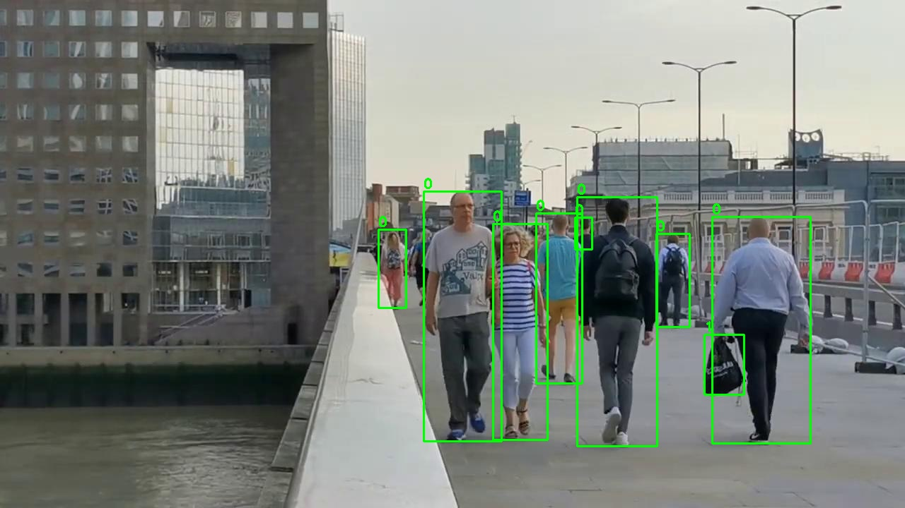
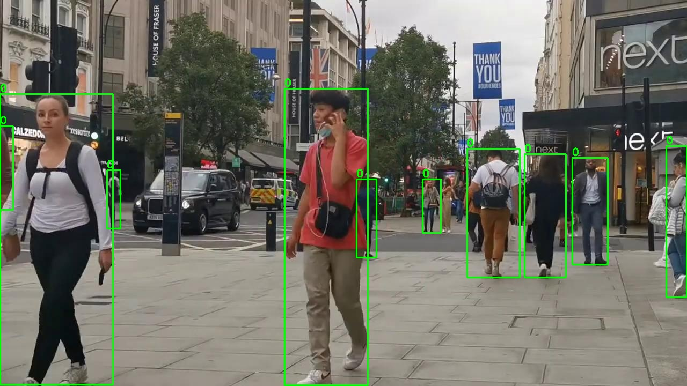
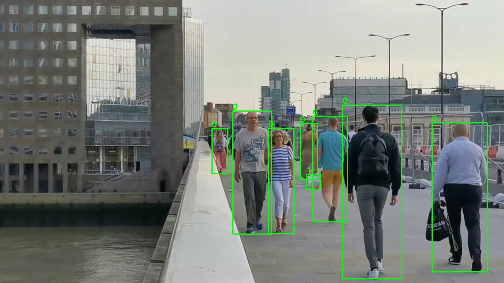
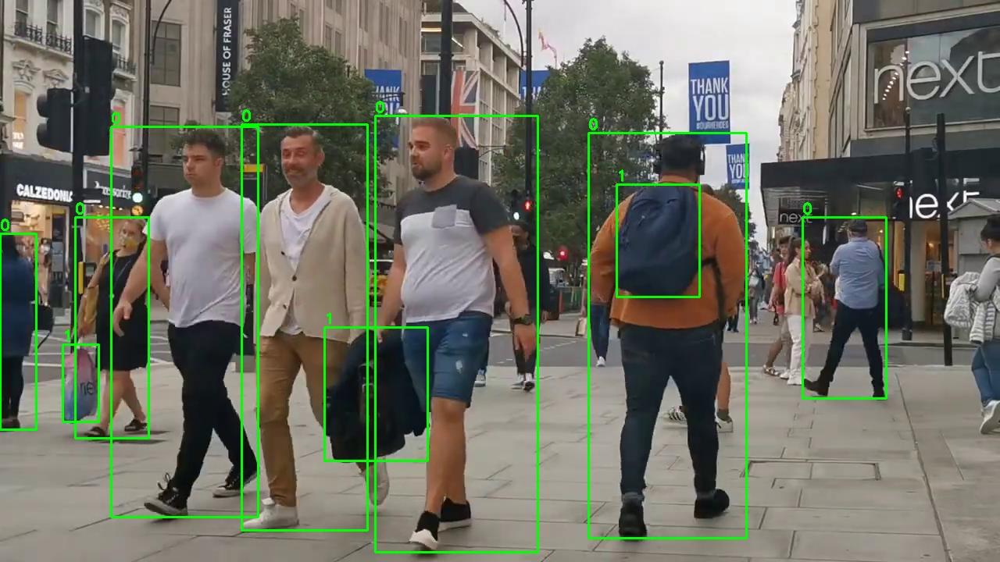
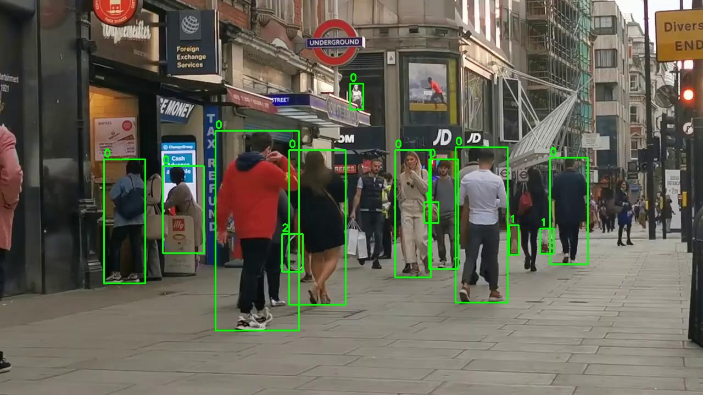

# 🤖 Auto Labeling & YOLOv8 Fine-Tuning Pipeline with Autodistill

Automatically convert videos into annotated datasets and train powerful YOLOv8 models — **with zero manual labeling**.

This notebook delivers a full end-to-end pipeline using [Autodistill](https://github.com/autodistill/autodistill) + Grounded SAM to generate segmentation-based annotations from video frames, convert them to YOLO bounding boxes, and fine-tune a YOLOv8 model — all inside a single environment.

---

## 🌟 Key Highlights

- 🚀 **End-to-End Automation:** From raw video to a trained object detection model in a few clicks.  
- 🧠 **Foundation Models Powered:** Uses Grounded SAM + Autodistill for zero-shot segmentation and labeling.  
- 🎯 **YOLO-Ready:** Converts segmentation masks to YOLOv8 bounding boxes automatically.  
- ⚙️ **Fine-Tuning Included:** Train a custom YOLOv8 model using your auto-labeled data.  
- 🖼️ **Visual Previews:** Inline visualization of segmentation and bounding box annotations.  

---

## 📥 Installation

Make sure you have Python 3.8+ and a CUDA-enabled GPU for best performance.
You are ready to run the notebook (All the dependencies will be installed within the notebook)

---

## 💻 How to Use This Notebook

1. **Launch Jupyter Notebook**:

2. **Follow the notebook step-by-step:**

   - **Step 1: Setup**  
     Verify GPU availability and install required libraries.

   - **Step 2: Input Configuration**  
     Provide the path(s) to your video file(s), choose the frame extraction stride (e.g., every 5th frame), and specify output folder names.

   - **Step 3: Frame Extraction**  
     Automatically extracts frames from the video and previews them.

   - **Step 4: Define Classes & Prompts**  
     Enter the object classes and corresponding natural language descriptions to guide auto-labeling.

   - **Step 5: Auto Annotation (Segmentation)**  
     Run Autodistill with Grounded SAM to generate segmentation masks and auto-label frames.

   - **Step 6: Data Curation**  
     Preview, filter, and delete any unwanted annotations.

   - **Step 7: YOLO Format Conversion**  
     Convert segmentation masks into YOLO bounding box format labels.

   - **Step 8: Dataset Split**  
     Automatically split data into training, validation, and testing sets, and create the YAML config.

   - **Step 9: YOLO Fine-Tuning**  
     Train a YOLOv8 model on the auto-labeled dataset.

---

## 🎥 Visual Demonstration

### Raw Input Video

---

### Auto-Annotation Output (Segmentation + Labels)

---

### YOLOv8 Inference on Video

---

## 🧪 Use Cases

- Rapidly prototype custom object detection models without manual labeling.  
- Build datasets from surveillance, drone, or industrial footage effortlessly.  
- Create training data for rare or specialized object classes with minimal cost.  
- Integrate with active learning loops by adding manual review after auto-labeling.

---